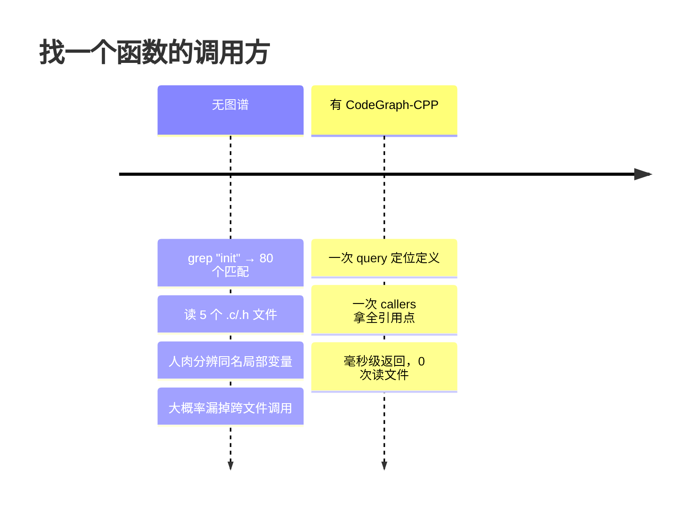
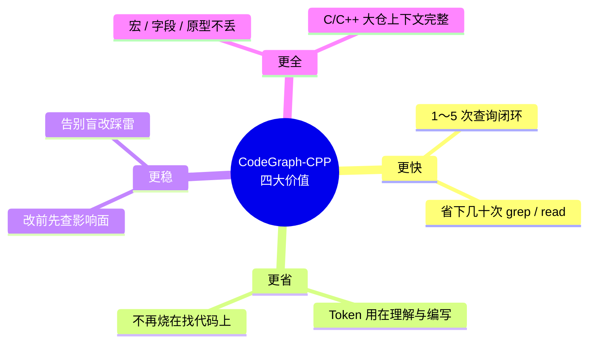
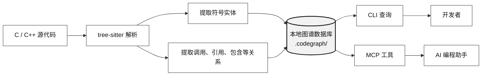
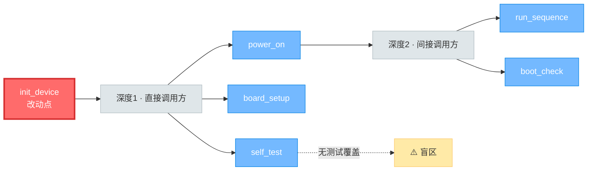
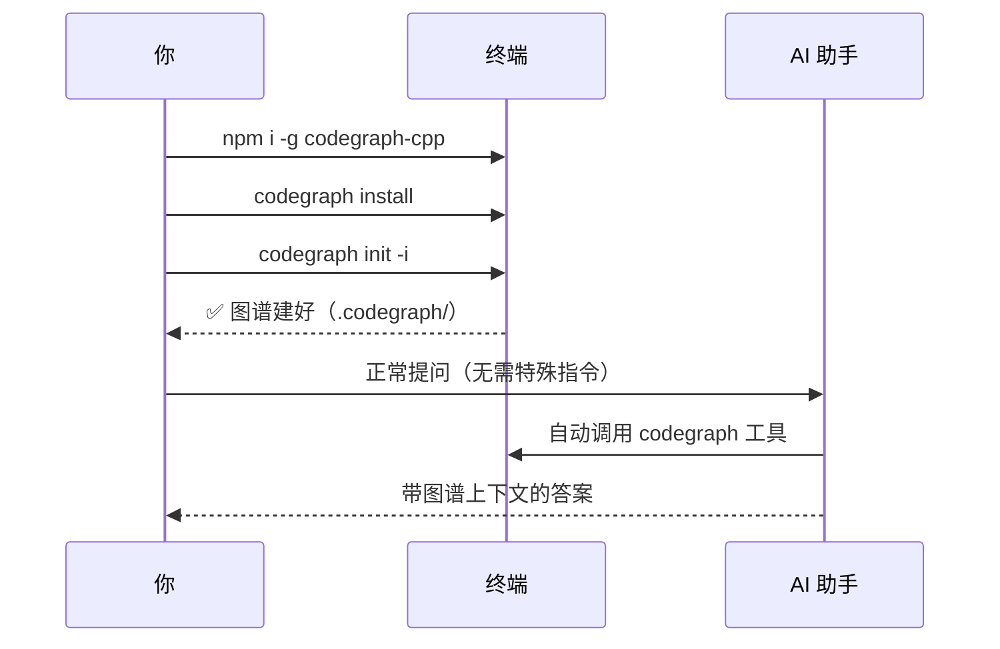
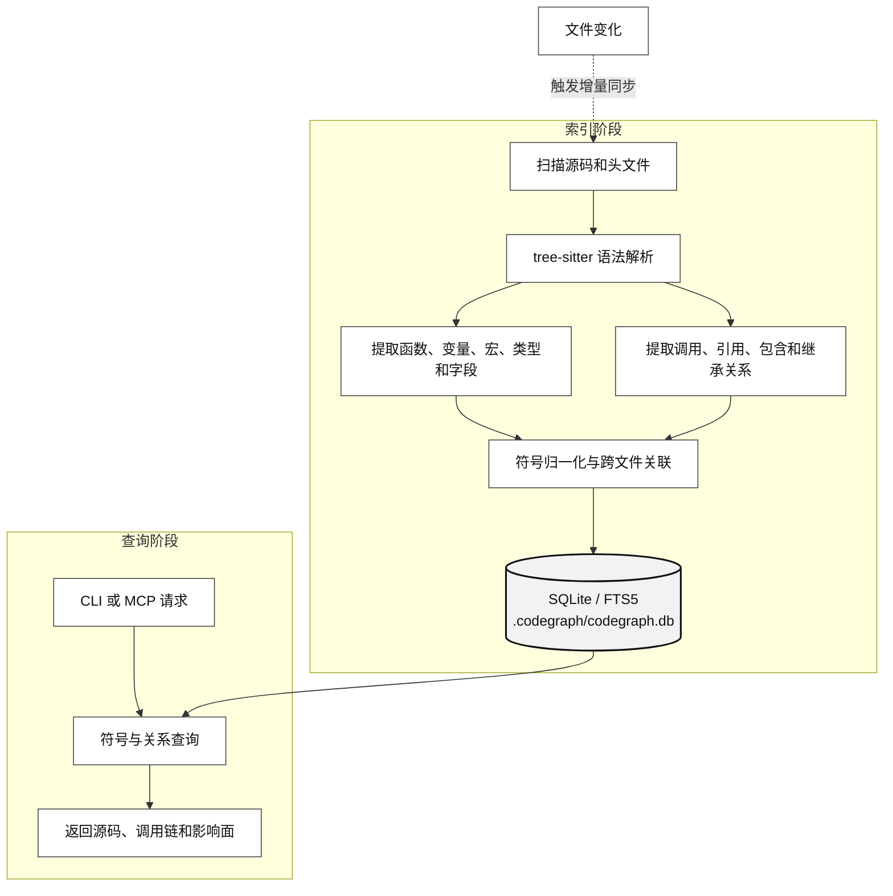
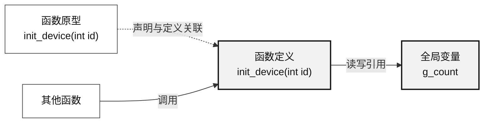

# CodeGraph-CPP

> 面向 C/C++ 千万行级存量代码仓的本地代码知识图谱 —— 让 AI 编程助手不再`grep → read → grep → read`地瞎摸，一次查询就能拿到符号、源码、调用链和影响面。

CodeGraph-CPP 基于开源 [CodeGraph](https://github.com/colbymchenry/codegraph) 演进，重点增强 C/C++ 大型代码仓的静态解析能力。项目针对宏、全局变量、结构体字段、`typedef`、头文件原型、`#include` 关系以及 `compile_commands.json` 编译信息等常见难点进行了专项适配，尽可能减少符号丢失、类型误判和跨文件关系断裂。所有数据 100% 留在本地，一个 `.codegraph/` 目录搞定。

---

## 它能为你做什么？

如果你有过下面任何一种经历，CodeGraph-CPP 就值得装：

- 👉 问 AI“这个函数在哪被调用？改它会影响谁？”，看着它`grep`几十个文件、读十几个头文件，烧掉一堆 Token 才敢回答。
- 👉 接手一个千万行的 C/C++ 老项目，找一条调用链要靠人肉跳转，跨文件跳到第三跳就迷路。
- 👉 改一个全局变量或接口，心里没底——不知道哪个模块在用、哪个测试会挂。
- 👉 想让 AI 生成新代码，但它给的上下文总是缺胳膊少腿，因为它根本没看全相关符号。

CodeGraph-CPP 把整个代码库提前解析成一张**可查询的图**：函数、变量、结构体、字段、宏、typedef、`#include` 都是节点，调用、引用、包含、继承都是边。AI（或你自己）直接查图，毫秒级拿到答案，**不再读文件**。



---

## 四个核心价值



| 价值 | 说明 |
|---|---|
| **更快** | 一个流程问题，AI 用 1～5 次图谱查询就能闭环，省下几十次 `grep`/`read`。 |
| **更省** | Token 不再烧在“找代码”上，而是用在“理解 + 写代码”上。 |
| **更稳** | 改代码前先查影响面，谁调用、谁依赖、哪个测试受影响一目了然，告别盲改。 |
| **更全** | C/C++ 容易丢的宏、全局变量、结构体字段、头文件原型都能被索引到，AI 拿到的上下文不再残缺。 |

## 从代码到 AI 上下文



---

## 使用场景

### 场景一：代码检索 —— “这东西在哪？谁在用？”

> “`g_session_counter` 这个全局变量都在哪些文件里被读写？”

没有图谱时，AI 得 `grep "g_session_counter"`，然后逐个读文件分辨“这是定义还是引用、是不是同名局部变量”。有了 CodeGraph-CPP，一次 `codegraph_search` + `codegraph_callers` 直接拿到：定义位置、所有引用点，且已排除同名局部变量和函数调用目标。

### 场景二：代码修复 —— “改这个函数会炸到谁？”

> “我要给 `init_device` 加个参数，影响面有多大？”



一条 `codegraph impact init_device --depth 3`，5 秒内拿到完整影响半径：谁调用了它、谁又调用了那些调用方、哪些测试文件覆盖了这条链。改之前就知道风险，而不是改完上线才发现。

### 场景三：代码生成 —— 给 AI 喂“完整上下文”

> “帮我实现一个新的 `close_device` 函数，风格和现有设备管理一致。”

AI 写新代码最怕上下文不全。用 `codegraph_node` 逐个读取 `init_device`、`deinit_device` 的**完整源码**（外加 caller/callee 调用链），再 `codegraph_node` 看一眼设备结构体和相关宏，AI 看着真实代码照葫芦画瓢，生成的代码命名、错误处理、日志风格都和项目一致，而不是凭空臆造。

### 场景四：代码理解 —— 接手老项目不再迷路

> “一个请求从入口 `process_request` 到最终写盘，经过哪些函数？”

从入口 `process_request` 起步，用 `codegraph_callees` 看它调用了谁，再沿调用方逐层下钻（`callees` 迭代 + `codegraph_impact --depth 4` 反向看影响面），跨文件、跨头文件的调用链就能拼出来，不用再手动跳转。配合 `codegraph_node` 随时读取某一跳的源码看具体实现。

### 场景五：CI 增量测试 —— 不再全量重跑

```bash
git diff --name-only HEAD | codegraph affected --stdin --quiet | xargs your-test-runner
```

改了 3 个文件，只跑受影响的 5 个测试，而不是全量跑 2000 个。

---

## 三分钟上手

### 1. 安装

```bash
# 已有 Node.js（推荐，最简单）
npm i -g codegraph-cpp
# 或零安装一次性运行
npx codegraph-cpp

# macOS / Linux 一键脚本
curl -fsSL https://your-host/install.sh | sh

# Windows PowerShell
irm https://your-host/install.ps1 | iex
```

安装脚本自带运行时，没有 Node.js 也能跑，无需编译。

### 2. 配置 AI 助手

```bash
codegraph install
```

自动检测你装了 Claude Code / Cursor / Codex CLI / opencode 等，帮你写好 MCP 配置。也支持 `codegraph install --yes` 一键全配。

### 3. 给项目建索引

```bash
cd your-c-or-cpp-project
codegraph init -i      # 交互式初始化 + 构建索引
codegraph status       # 查看索引：节点数、边数、后端类型
```

索引数据存在项目根目录 `.codegraph/` 下，**不要提交到代码仓**（加进 `.gitignore`）。



之后你在 AI 助手里正常提问即可，它会自动调用 CodeGraph 工具，无需手动操作。文件改动后索引会在约 2 秒内自动增量更新。

---

## 它和上游 CodeGraph 的区别

CodeGraph-CPP 是 CodeGraph 的 C/C++ 增强版，重点解决 C/C++ 大仓静态解析的“丢符号”和“误抽符号”问题：

- ✅ **宏可被搜索与追踪**：`#define MAX 100`、`#define LOG(fmt, ...)` 等宏能像函数一样按名搜索、追踪被谁引用。
- ✅ **跨文件宏不再误判**：在头文件 A 中定义、在文件 B 中通过 `#include` 使用的宏，能被正确识别为宏，而不会被误当成函数定义。
- ✅ **语句级宏不再吞符号**：`FOREACH(...)`、`SWITCH(x){...}` 这类语句级宏原本会破坏函数体、连带吞掉后续数百行声明；现在被破坏的函数和被吞的符号都能正常进图。
- ✅ **不产生假函数**：宏调用不会被误解析成不存在的假函数，搜索结果更干净。
- ✅ **同名宏与函数共存**：函数与 `#define` 同名（常见 debug 包装宏）时，真实的函数定义和声明都会保留，不会被宏吃掉。
- ✅ **多宏修饰的函数名能取对**：`RRE_ATTRIBUTE_VISIBILITY VOS_UINT32 func(VOS_VOID)` 能正确识别出函数名 `func`，而不是把 `(VOS_VOID)` 当成函数名。
- ✅ **头文件原型与定义连通**：`.h` 里的原型和 `.c`/`.cpp` 里的定义会被识别为同一个符号——在原型上查调用方/被调方，就能看到定义里真实的调用链，不再出现“查到原型却看不到函数体调了什么”的死端。
- ✅ **头文件原型完整可见**：`int foo();`、`extern int bar(void);` 等原型都会被索引，公共 API 不会因“只有声明没有函数体”而丢失。
- ✅ **`extern` 变量声明不丢**：`extern const T g_table[];` 这类声明会被保留并可搜索，即使它的定义在未纳入索引的第三方库源码里，也不会从声明所在头文件丢失。
- ✅ **函数/方法都带参数签名**：函数定义和类内成员原型都会回显完整参数签名（保留 `int*`、`vector<T>&` 等修饰），同名重载一眼可辨。
- ✅ **全局/静态/常量变量全支持**：`int g_counter = 0;`、`static int s_x;`、`const int MAX = 100;` 都能识别，`static` 变量标记为不导出。
- ✅ **结构体/类字段逐个提取**：`struct S { int id; char name[32]; };` 的每个字段都能单独检索。
- ✅ **类内类型定义不漏**：`class Foo { enum Color {...}; struct Err {...}; };` 这类写在类里的 `enum`/`struct`/`class` 定义及其成员，都会正常进图。
- ✅ **`typedef` 多别名与 tag 名都可搜**：`typedef struct Tag {...} A, B;` 里除第一个别名 `A` 外，`B` 和结构体 tag 名 `Tag` 现在也都能被检索到。
- ✅ **函数体内宏可检索**：函数体里 `#define` 的局部宏也能被搜索到，且不再产生把宏参数误当外部变量的虚假引用关系。
- ✅ **C++ 引用返回/引用成员不丢**：`APIRegister& get_instance()` 的名字能正确识别（不再残留 `&`、`()`），只有声明的引用返回成员和引用数据成员也都会被索引。
- ✅ **函数指针 typedef 名字正确**：`typedef TYPE (*NAME)(...)` 形式的函数指针 typedef，名字能正确识别（不再带 `*`）；整仓建库时也不会因宏污染连带丢失相关字段和结构体。
- ✅ **多属性宏堆叠的原型能识别**：头文件里被多个属性宏前缀修饰、参数列表后还带尾随宏调用的函数原型，能被正确识别为声明（此前这类原型会整个丢失）。
- ✅ **多声明器拆分**：`int x, y, z;` 会被拆成三个独立变量，都能单独检索。
- ✅ **跨文件调用/引用连通**：`#include` 关系会被解析，配合 `compile_commands.json` 的 `-I` 路径，跨文件的调用和引用能正确连起来。
- ✅ **全局变量引用追踪准确**：函数体内对 `g_` 前缀全局变量的读写会被追踪，并自动排除同名局部变量、参数和函数调用目标，不产生误连。
- ✅ **`codegraph query` 默认精确匹配**：按名搜索默认改为精确、区分大小写，不再连带返回大小写不同或名字相近的近似命中；需要模糊匹配时加 `--fuzzy`。MCP 的 `codegraph_search` 仍保留对 AI 友好的模糊匹配。
- ✅ **宏处理不误伤合法代码**：初始化列表/聚合体里的宏、CRLF 续接的多行 `#define`、以及 `template<class T>` 等模板代码，都不会被宏处理破坏。

> 简单说：上游 CodeGraph 在 C/C++ 上容易“丢字段、丢原型、把宏当函数、声明与定义断开”；CodeGraph-CPP 把这些洞补上了。

---

## 它是怎么工作的



整张图就是项目里一个 `.codegraph/codegraph.db` 文件，可以复制、备份、带走——完全便携。

比如这段 C 代码：

```c
int g_count = 0;

int init_device(int id) {
    g_count++;
    return id;
}
```

在 CodeGraph-CPP 里会变成这几个节点和边：



查 `init_device` 的调用方时，连只 `#include "device.h"` 的文件也能被追到——因为原型和定义已连成同一个节点。

---

## 常用命令速查

```bash
codegraph init -i                  # 初始化 + 构建索引
codegraph status                   # 查看索引统计
codegraph query g_counter --kind variable   # 按名称/种类搜索符号
codegraph callers g_counter        # 谁引用了它
codegraph callees init_device      # 它调用了谁
codegraph impact init_device --depth 3      # 影响面分析
codegraph files --filter src --format tree  # 索引化的文件结构
codegraph sync                     # 增量同步
codegraph index --force            # 强制全量重建
codegraph affected src/foo.c       # 受改动影响的测试文件
```

---

## 配置 AI 助手（MCP）

`codegraph install` 会自动写入配置。手动配置示例：

```json
{
  "mcpServers": {
    "codegraph": {
      "command": "codegraph",
      "args": ["serve", "--mcp"]
    }
  }
}
```

AI 助手默认可用的 **7 个 MCP 工具**：

- `codegraph_search` — 按名称搜索符号
- `codegraph_node` — 读取符号详情、完整源码与调用链（读代码主力）
- `codegraph_callers` / `codegraph_callees` — 查调用方 / 被调方
- `codegraph_impact` — 修改影响面分析
- `codegraph_files` — 索引化的文件结构
- `codegraph_status` — 索引健康度与统计

> 另有一个 `codegraph_explore`（一次调用批量取多个符号源码并串调用路径）**默认关闭**，需要时设环境变量 `CODEGRAPH_ENABLE_EXPLORE=1` 重启 MCP 服务器即可开放。完整用法见 **[用户手册](docs/manual/README.md)**。

---

## 部署说明

- 优先使用 Node 内置 `node:sqlite`，不可用时回退 `sql.js` WASM；`CODEGRAPH_FORCE_WASM=1` 可强制 WASM。
- 无 `better-sqlite3` 依赖，降低低版本 glibc / 受限环境部署成本。
- 文件监听不稳定时可用 `codegraph serve --mcp --no-watch`。

## 开发

```bash
npm install
npm run build
npm test
npm run cli -- --help
```

构建自包含 bundle：

```bash
scripts/build-bundle.sh linux-x64
scripts/build-bundle.sh linux-arm64
scripts/build-bundle.sh win32-x64
```

## 许可

CodeGraph-CPP 基于开源 CodeGraph 演进，沿用 MIT License。