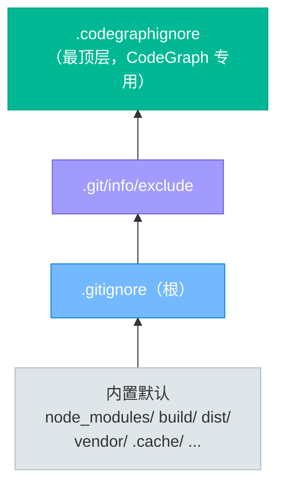

# 第 3 篇：核心命令

`codegraph` 是命令行入口。所有子命令都对着“当前目录所在项目”操作，除非用 `-p/--path` 指定别的项目路径。下面按用途分组讲解。

## 一、速查表

| 命令 | 作用 |
|---|---|
| `codegraph install` | 配置 AI 助手（写 MCP 配置） |
| `codegraph uninstall` | 从 AI 助手移除 CodeGraph |
| `codegraph upgrade` | 检查 / 安装新版本 |
| `codegraph init [path]` | 项目初始化 + 构建索引 |
| `codegraph uninit [path]` | 删除项目的 `.codegraph/` |
| `codegraph index [path]` | 全量（重新）索引 |
| `codegraph sync [path]` | 增量同步 |
| `codegraph status [path]` | 查看索引统计 |
| `codegraph query <关键词>` | 按名称搜索符号 |
| `codegraph node [符号]` | 读整文件 / 读符号详情+调用链 |
| `codegraph callers <符号>` | 谁调用了它 |
| `codegraph callees <符号>` | 它调用了谁 |
| `codegraph impact <符号>` | 修改影响面 |
| `codegraph affected [files...]` | 受改动影响的测试文件 |
| `codegraph files` | 索引化的文件结构 |
| `codegraph serve --mcp` | 启动 MCP 服务器 |
| `codegraph unlock [path]` | 解除索引锁（异常退出后） |

## 二、安装与配置类

### `codegraph install` —— 配置 AI 助手

```bash
codegraph install                 # 交互式：选配哪个 AI、装到哪
codegraph install --yes           # 一键：全局 + 自动检测到的全部 AI
codegraph install --target claude # 只配指定 AI
codegraph install --location local# 只配当前项目（而非全局）
codegraph install --print-config cursor  # 只打印配置片段，不写文件
```

- `--target <ids>`：逗号分隔的 AI id，或 `auto`/`all`/`none`。
- `--location <where>`：`global`（默认）或 `local`。
- `--yes`：非交互，等价于 `--location=global --target=auto`。
- `--no-permissions`：跳过自动写入工具白名单（仅 Claude Code 相关）。

### `codegraph uninstall` —— 移除配置

```bash
codegraph uninstall --yes         # 从所有 AI 移除
codegraph uninstall --target cursor
```

### `codegraph upgrade` —— 升级

```bash
codegraph upgrade --check         # 只检查有没有新版本
codegraph upgrade --force         # 即使已是目标版本也重装
codegraph upgrade 0.9.9           # 升级到指定版本
```

> 完整的升级流程、不同安装方式的升级行为、升级后刷新索引与重启守护进程、Windows 注意事项与排错，见 [第 6 篇：升级指南](06-upgrade-guide.md)。

## 三、索引类

### `codegraph init` —— 初始化并构建索引（最常用）

```bash
cd your-project
codegraph init           # 初始化并构建索引（默认即建索引）
codegraph init -v        # 显示解析 worker 详细信息
```

- `-i/--index`：兼容旧用法，现在默认就会建索引，该flag已无实际作用。
- `-v/--verbose`：打印 worker 生命周期与内存信息，排查慢索引时用。

> 索引自动遵循 `.gitignore`，并对常见依赖/构建目录（`build/`、`dist/`、`node_modules/`、`vendor/` 等）内置排除。要排除项目特有的生成代码或第三方 SDK，写进根目录的 `.codegraphignore`（语法同 `.gitignore`），见 [六、`.codegraphignore`](#六codegraphignore--索引排除规则)。

### `codegraph index` —— 全量重建

```bash
codegraph index --force     # 强制全量重建
codegraph index --quiet     # 静默（CI/脚本里用）
```

- `-f/--force`：即便已索引也重建。
- `-q/--quiet`：抑制进度输出。

### `codegraph sync` —— 增量同步

```bash
codegraph sync              # 按文件大小/mtime/内容哈希同步变更
codegraph sync --quiet      # git hook 里用，只输出必要信息
```

> 正常开发不用手动跑——MCP 模式下文件监听器会在约 2 秒内自动增量同步。`sync` 主要给 CI / git hook / 关闭监听的场景用。

### `codegraph uninit` —— 删除索引

```bash
codegraph uninit            # 删除 .codegraph/（会确认）
codegraph uninit --force    # 跳过确认
```

### `codegraph unlock` —— 解除索引锁

```bash
codegraph unlock            # 进程异常退出留下锁时用
```

## 四、查询类

### `codegraph status` —— 索引统计

```bash
codegraph status
codegraph status --json     # 机器可读
```

输出节点数、边数、后端类型（`native`/`wasm`）、文件数等。判断“索引是否最新、后端是不是快的那个”就看这里。

### `codegraph query` —— 搜索符号

```bash
codegraph query g_counter                       # 按名称搜
codegraph query g_counter --kind variable       # 只搜变量
codegraph query init_device --limit 20          # 多返回一些
codegraph query foo --fuzzy                     # 模糊匹配（前缀+子串+编辑距离回退）
codegraph query foo --json                      # 机器可读
```

- `-k/--kind <kind>`：按节点种类过滤，如 `function`/`variable`/`macro`/`struct`/`field` 等。
- `-l/--limit <number>`：最多返回几个，默认 10。
- `--fuzzy`：严格匹配搜不到时用，放宽匹配。
- `-p/--path <path>`：查别的项目。

### `codegraph callers` —— 谁调用了它

```bash
codegraph callers init_device           # 谁调用了 init_device
codegraph callers g_counter --limit 50  # 引用方（变量用 callers 查引用）
codegraph callers foo --json
```

对变量节点，`callers` 返回的是引用方（读/写它的地方）。

### `codegraph callees` —— 它调用了谁

```bash
codegraph callees init_device
codegraph callees main --limit 50
```

### `codegraph impact` —— 修改影响面

```bash
codegraph impact init_device             # 默认深度 2
codegraph impact init_device --depth 3   # 追更深
codegraph impact init_device --json
```

- `-d/--depth <number>`：依赖遍历深度，默认 2。改核心函数建议调到 3～4 看全貌。

> 这是改代码前最该跑的一条命令：直接告诉你改一个符号会波及哪些下游。

### `codegraph node` —— 读整文件 / 读符号详情（`codegraph_node` 的 CLI 版）

和 MCP 工具 `codegraph_node` 对齐的命令行版，两种模式：

**文件模式**（只传 `-f/--file`，不传符号）——像 Read 一样读整文件：

```bash
codegraph node -f src/device.c              # 读整文件（带行号，可直接编辑）
codegraph node -f src/device.c -o           # 只看符号大纲，不要源码
codegraph node -f src/device.c --offset 100 --limit 40   # 翻页（同 Read 语义）
codegraph node -f src/device.c --json
```

输出是带行号的源码（`<行号>\t<该行>`），并附一行"哪些文件依赖它"的影响面提示。配置/数据文件（`.yml`/`.properties` 等）只按 key 摘要、值不输出，避免泄露密钥。

**符号模式**（传符号名）——读一个符号的详情、源码和调用链：

```bash
codegraph node init_device                  # 位置/签名 + 调用链（callees/callers）
codegraph node init_device -c               # 再加上完整源码
codegraph node Widget.build -c              # 限定名消歧（类.方法）
codegraph node handle --file session.c -c   # 同名重载时，按文件钉到某一个
codegraph node handle --line 153 -c         # 按行号钉到某个重载
codegraph node init_device --json
```

- `-c/--code`：符号模式下附带完整源码；容器类（class/struct/interface 等）返回成员大纲而非整段源码。
- `-f/--file <path>`：单独用=读整文件；和符号一起用=在同名重载里按文件消歧。
- `--line <n>`：按行号钉到某个重载。
- `--offset <n>` / `--limit <n>`：文件模式按行翻页（1-based，同 Read）。
- `-o/--symbols-only`：文件模式只返回符号大纲。
- 同名重载（多个定义同名）会一次返回所有定义，不用先猜再读文件。

> 这是信息量最大的一条：一次同时拿到源码和调用链，是理解代码、改代码前摸底的首选。

### `codegraph affected` —— 受影响的测试文件

```bash
codegraph affected src/device.c src/board.c        # 指定改动文件
git diff --name-only HEAD | codegraph affected --stdin   # 从 stdin 读
codegraph affected --stdin --quiet                   # 只输出文件路径
codegraph affected --stdin --filter "test/*.c"      # 自定义测试文件 glob
codegraph affected --stdin --depth 6
```

- `--stdin`：从标准输入读文件列表（一行一个），配合 `git diff` 用。
- `-d/--depth <number>`：依赖遍历深度，默认 5。
- `-f/--filter <glob>`：自定义测试文件匹配模式。
- `-q/--quiet`：只输出文件路径，方便管道给测试运行器。

典型 CI 用法：

```bash
git diff --name-only origin/main...HEAD \
  | codegraph affected --stdin --quiet \
  | xargs your-test-runner
```

### `codegraph files` —— 索引化的文件结构

```bash
codegraph files                               # 树形输出
codegraph files --filter src                  # 只看 src 下
codegraph files --pattern "**/*.h"            # 只看头文件
codegraph files --format flat                 # 平铺列表
codegraph files --format grouped              # 按语言分组
codegraph files --no-metadata                 # 隐藏语言/符号数
codegraph files --max-depth 3                 # 限制树深度
codegraph files --json
```

比 `ls`/`find` 聪明：只列被索引的文件，带语言和符号数。

## 五、MCP 服务类

### `codegraph serve` —— 启动 MCP 服务器

```bash
codegraph serve --mcp                 # 标准启动（stdio 传输）
codegraph serve --mcp --no-watch      # 关掉文件监听（慢文件系统用，如 WSL2 /mnt）
codegraph serve --mcp --path /proj/x  # 指定项目
```

> 日常不用手动跑——`codegraph install` 配好后，AI 助手会自动拉起 MCP 服务器。手动跑通常是为了排查连接问题。

## 六、`.codegraphignore` —— 索引排除规则

索引哪些文件由一条**忽略链**决定，从下到上逐层叠加，**上层覆盖下层**：



- **内置默认**：常见依赖/构建/缓存目录（`node_modules/`、`build/`、`dist/`、`out/`、`vendor/`、`.cache/`、`__pycache__/`、`.venv/`、`Pods/`、`DerivedData/`、`vcpkg_installed/`、`*.egg-info/`、`cmake-build-*/` 等）。**即使这些目录被 git 跟踪、`.gitignore` 没忽略它们，CodeGraph 也不会索引**——提交了依赖目录并不代表它是项目代码。
- **`.gitignore`（项目根）**：照搬你已有的忽略规则，无需重复配置。`.gitignore` 里的 `!` 取反（如 `!vendor/`）可以**覆盖内置默认**，把默认排除的目录重新纳入。
- **`.git/info/exclude`**：git 仓库本地、未提交的排除规则，同样生效。
- **`.codegraphignore`（项目根，可选）**：最顶层，专门给 CodeGraph 用。在这里加的排除只影响索引，不污染你的 `.gitignore`；它的 `!` 取反可以覆盖前面任何一层（包括内置默认和 `.gitignore`）。

### `.codegraphignore` 怎么写

放在**项目根目录**，语法和 `.gitignore` 完全一致（由 `ignore` 库解析）。只读根目录这一个，不看子目录里的。

```gitignore
# 这是注释

# 排除整个目录（末尾斜杠表示目录）
generated/
third_party/

# 按扩展名排除
*.generated.c
*.pb.c

# 任意深度匹配
**/proto-gen/

# 锚定到项目根（开头的 / 表示根）
/build/linux/

# 取反——重新纳入（覆盖上层排除）
!src/generated/api.h
!vendor/our_sdk/
```

### 什么时候该用它

| 场景 | 推荐做法 |
|---|---|
| 想排除的文件本来就在 `.gitignore` 里 | 啥都不用做，CodeGraph 自动遵循 `.gitignore` |
| 想排除的文件**没**被 git 忽略（如生成代码、第三方 SDK），但不想索引它们 | 写进 `.codegraphignore`，保持 `.gitignore` 干净 |
| 想把内置默认排除的目录重新纳入索引（如自己魔改过的 `vendor/`） | 在 `.codegraphignore` 里写 `!vendor/` 取反 |
| 想把 `.gitignore` 已忽略的文件重新纳入索引 | 在 `.codegraphignore` 里写 `!path/to/file` 取反 |

> `.codegraphignore` 适合**团队共享**的排除规则——把它提交到代码仓，团队成员建索引时行为一致。只针对自己本机的临时排除，写进 `.git/info/exclude` 更合适（不会被提交）。

### 一个性能注意：取反会触发全量扫描

`.codegraphignore` 里只要出现**任何一条 `!` 取反规则**，CodeGraph 就会**放弃 git 快速路径、改走文件系统遍历**。原因是：取反要把 `.gitignore` 已经排除的文件重新拉回来，而 `git ls-files` 根本不会列出这些文件，快速路径拿不到它们。

- 没有取反规则时：`init` / `sync` 优先用 `git ls-files` / `git status`，很快。
- 有取反规则时：每次都全盘扫描文件系统，大仓上首次索引会明显变慢。

**所以：只在确实需要把被忽略文件拉回索引时才用 `!`；单纯排除新文件用普通规则即可，不触发全量扫描。**

### 改完之后

`.codegraphignore` 改动后，下次 `codegraph sync` 增量同步会自动按新规则调整；为确保彻底刷新（比如取反重新纳入了之前没索引的文件），建议跑一次全量重建：

```bash
codegraph index -f    # 按新忽略链全量重建
```

---

## 七、常用工作流速查


---

下一篇：[第 4 篇：MCP 工具详解](04-mcp-tools.md)